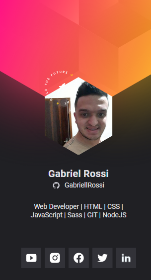

<h1 align="center">
  Cracha Virtual - NLW Heat
</h1>

  <a href="#-tecnologias">Tecnologias</a>&nbsp;&nbsp;&nbsp;|&nbsp;&nbsp;&nbsp;
  <a href="#-projeto">Projeto</a>&nbsp;&nbsp;&nbsp;|&nbsp;&nbsp;&nbsp;
  <a href="#-inspiração">Inspiração</a>&nbsp;&nbsp;&nbsp;|&nbsp;&nbsp;&nbsp;

 

  

 

## 🚀 Tecnologias

Esse projeto foi desenvolvido com as seguintes tecnologias:

- HTML
- CSS
- JavaScript

## 🚧 Projeto

[🔗 Clique aqui para acessar](https://cracha-nlw-heat-gabriellrossi.vercel.app/)

## 🎨 Inspiração

[🔗 FIGMA](<https://www.figma.com/file/aaKwbSxMsZSMvrn3raRoEn/%5BNLW-Heat---Mission%3A-Origin%5D-DoWhile2021-(Community)>)

## :memo: Licença

Esse projeto está sob a licença MIT. Veja o arquivo [LICENSE](LICENSE) para mais detalhes.

---

Feito com ♥ by GabriellRossi
